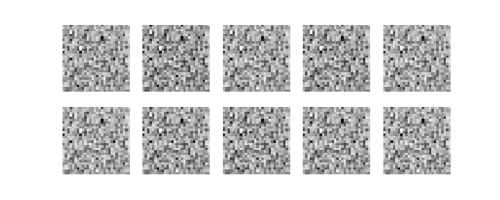
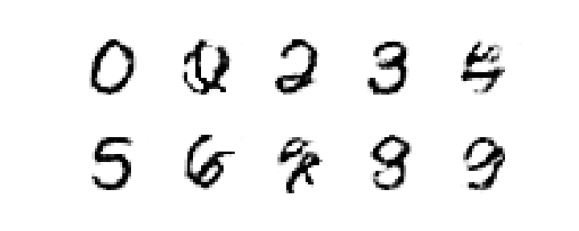
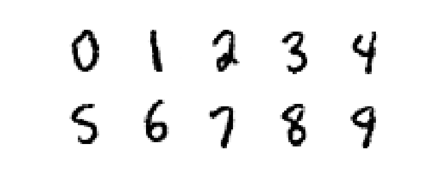

# SimpleCGAN
This is a simple implementation of a CGAN network. When trained is able to generate images of user specified numbers.

## Tested Environment
<table>
  <tr>
    <td><b>OS</b></td>
    <td><b>Python</b></td>
    <td><b>Tensorflow</b></td>
    <td><b>CUDA</b></td>
    <td><b>CuDNN</b></td>
  </tr>
  <tr>
    <td>Windows 10</td>
    <td>3.6</td>
    <td>1.12</td>
    <td>9.0</td>
    <td>7.1.4</td>
  </tr>
</table>

## Getting Started
This code was developed using Anaconda in a virtual environment using Python 3.6. If you plan on running this code, we recommend using the environments we already tested. Tested environments are shown in the table above.

## Installing Anaconda
The easiest way to install Anaconda is to follow [instructions provided here](http://docs.anaconda.com/anaconda/install/).
### Create Virtual Environment
```
conda create -n venv
```
### Activate Virtual Environment
```
conda activate venv
```
### Deactivate Virtual Environment
**_Deactivate the virtual environment only when done_**
```
conda deactivate
```
## Pre-Requisites
```
conda install cudatoolkit
conda install cudnn
conda install tensorflow-gpu
conda install matplotlib
```
(Optional)Install Spyder
```
conda install spyder
```
## Training
Running the ``cgan.py`` will train the network using the MNIST dataset.
### Two phase training
#### Phase one: Initial Discriminator Training
In this phase, we only train the discriminator for a few iterations in order to obtain an initial discriminator that is usable for training the generator
##### Output Example
```
dLossRealScore: 0.69463027 dLossRealClass: 2.3025913 dLossFake: 0.6924542
dLossRealScore: 1.3723836e-08 dLossRealClass: 1.811222 dLossFake: 1.0014443e-08
dLossRealScore: 8.087311e-12 dLossRealClass: 1.6621327 dLossFake: 2.2389901e-07
```
``dLossRealScore``: Gives the loss of the score given by the discriminator when using images from the groundtruth dataset
``dLossRealClass``: Gives the loss of the class given by the discriminator when using images from the groundtruth dataset
``dLossFake``: Gives the loss of the score given by the discriminator when using images generated by the generator

#### Phase Two: CGAN Training
In this phase, we simutaneously train the discriminator and the generator. Images from the groundtruth dataset are used as positive samples, and images generated by the generator are used as negative samples.
##### Output Example
The nework is tested every 100 Iterations. During testing, all numbers 0 ~ 9 are generated by the generator using a single random latent vector (seed). A test output example is shown below.
```
Iteration: 0 at 2018-11-26 15:54:15.317770
dLossReal: 0.5141617 dLossFake: 1.971554e-13
Generate Class:  [0]
Estimate Score: [[-29.828016]]
Estimate Class: 3
```
``dLossReal``: Gives the batch loss of the discriminator in this iteration when using images from the groundtruth dataset (The lower the better)
``dLossFake``: Gives the batch loss of the discriminator in this iteration when using images generated by the generator (The lower the better)
``Generate Class``: Gives the target class to be generated
``Estimated Score``: Gives the discriminator score of the generated test image (The higher the better)
``Estimated Class``: Gives the discriminator class of the generated test image



At first the generated images will look like noise



But after around 20k iterations, the generator should start to be able to generate some images that look like numbers



The trained network should give somewhat good results

## Author

* **Jonathan Guo** - *Initial Work*

## License

This project is licensed under the MIT License - see the [LICENSE](LICENSE) file for details

## Acknowledgments

This code was initially written by following the [Generative Adversarial Networks for beginners](https://www.oreilly.com/learning/generative-adversarial-networks-for-beginners) tutorial by Jon Bruner and Adit Deshpande. I then modified into CGAN
